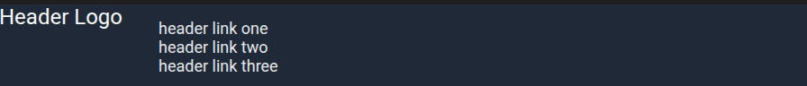
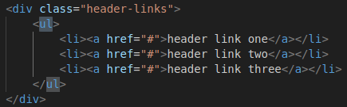
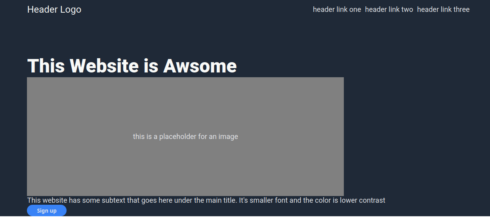
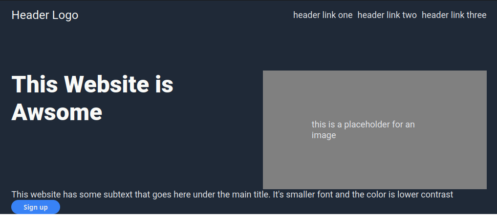
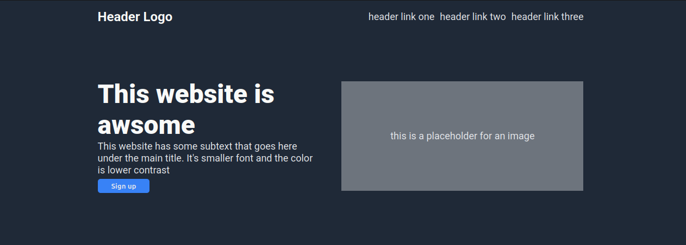
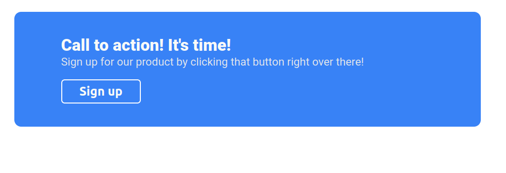
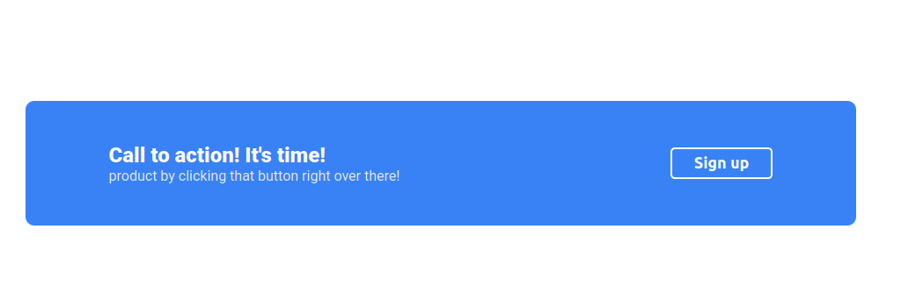

# Odin Project Assignment #2 - Landing Page:
This assignment requires me to re-create a web page from scratch, closely following [TheOdinProject](https://www.theodinproject.com)'s design, while demonstrating what I've learned about Flexbox.

<!--Required colors & font styles:-->

## Challenges I Encountered and How I Solved Them:

### Challenge 1:
Trying to get header-links (one, two, and three) to be aligned in a row centered to the top right

#### Solution:
The culprit that prevented the header links from being a row was `<ul>` in index.html, removing it solved the issue.

#### Result:

### Challenge 2:
Trying to put hero main text, hero image, and hero secondary text to align like the odin project's example

I put hero `main-text` & `hero-image` in a container, then put the hero `secondary-text` and `sign-up` button below it, I was able to get the result closer to odin's example but the issue is the `hero-image`'s makes a large gap between hero `main-text` and hero `secondary-text`, I think I need to adjust my `
` container placement and a few changes to the CSS.

#### Solution:
This is most likely the hardest challenge for this assignment, I had to go back and look at my practice css flexbox exercises, specifically exercise number 5 flex-modal. The issue was my `
` placment and my order of html elements was wrong, I had to create two new `
` containers, one for all of the hero elements called `hero-content`, and another for `hero-image` called `hero-content-right`. I placed `hero-content-right` below `hero-secondary`, and moved `main-text` above `hero-secondary` container, did a few adjustments to the CSS and that fixed my issue.

#### Result:

### Challenge 3:
The `call2action` sign up button keeps stretching and would not be the desired size unless it wrapped below `call2action`'s `secondary-text`.

This is what I wanted the button to look like (this is when it wraps):

#### Solution:
I solved the issue by putting `sign-up` button inside a new `
` container called `call2action-content-right`, then added new lines of CSS to center it, and that fixed the problem. 

**Note to Self:** Put `<button>` element in it's own `
` container when using flexbox.

#### Result:
